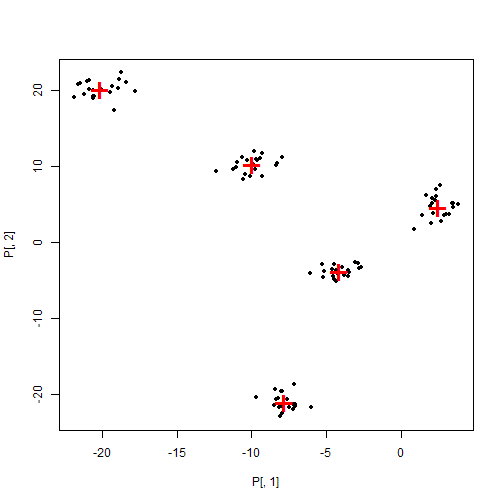
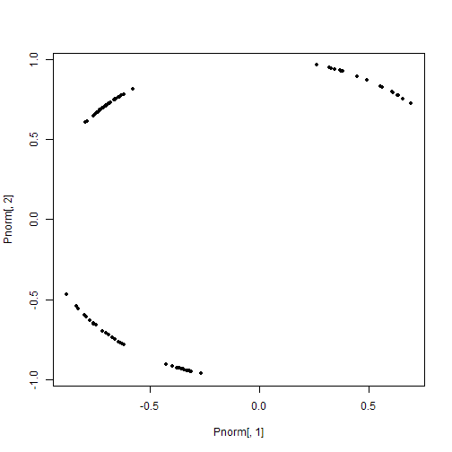
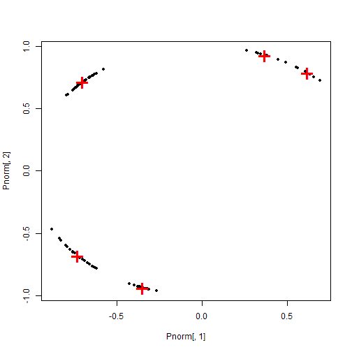

# Kmeans简介与其R实现

### Kmeans是什么

聚类分析是一类重要的非监督学习任务。在我们缺乏数据标签的时候，聚类分析是将数据根据相似程度打包分类的好方法。而Kmeans则是聚类分析中最常用的算法之一。

现在常用的Kmeans是一个不断迭代优化的算法。它的基本运算步骤如下：

1. 输入参数（需要聚类的数据，聚类中心个数），初始化随机选择聚类中心
2. 计算每个数据点到每个聚类中心的距离，并将数据点分为离它最近中心的类别
3. 计算每个类的新中心
4. 迭代重复2-3步，更新聚类结果
5. 输出聚类结果

这么说可能有些抽象，让我们来看一看下面这幅动态图：


图中五团黑色的点代表我们的无标签数据，而红色的十字表示迭代时不断变化的聚类中心。可以发现，在刚开始第一次迭代的时候，聚类中心都是随机生成的，缩成一团：


每个数据点都要对这些缩成一团几乎没有差别的中心计算距离，然后看看自己离哪个中心最近，从而暂时确定类别。每个数据点的类别都确定了之后，接下来分别计算每个类里数据点的重心（即平均坐标），我们可以发现有两个中心比较准确地找到了两团数据点的中心：


接下来第三步出现了不太幸运的事情：左上角的两团数据点共享一个中心，导致所有数据点所分的类别只有4个。


那么还有一个中心如何计算其坐标呢？这里采用的策略是对其他4个中心的位置加上随机权重进行平均，求出的坐标就是第5个中心。可以看出，实际上从第2步开始，这个中心就开始了漫长的随机漂泊之旅。直到第10步：


第5个中心正好随机落在某个数据团的中心，这样这个数据团所分的类别变成了第5类，只有左上角的数据分为第四类――重新计算重心之后，我们就得到了稳定的聚类结果。

----------

### R中的Kmeans

R里自带了Kmeans函数，用以方便地实现基本的Kmeans算法。我们首先生成之前演示用的数据：


```r
set.seed(1024)
P = do.call(rbind, rep(list(matrix(rnorm(10, sd = 10), ncol=2)), 20))
P = P + matrix(rnorm(200), ncol =2)
plot(P[,1],P[,2],pch=20)
```

 

接下来使用Kmeans算法求出结果，并且画图：


```r
a = kmeans(P,centers = 5, iter.max=100)
plot(P[,1],P[,2],pch=20)
points(a$centers[,1],a$centers[,2],col=2,pch='+',cex=3)
```

 

可以看到，我们又遇到了“两个数据团共享一个中心”的情况，如何解决呢？在kmeans函数中，我们可以设置一个参数`nstart`，它表示我们要尝试多少个不同的随机初始值。在很多迭代算法中，初始值往往是影响效果的重要因素。


```r
a = kmeans(P,centers = 5, iter.max=100, nstart = 5)
plot(P[,1],P[,2],pch=20)
points(a$centers[,1],a$centers[,2],col=2,pch='+',cex=3)
```

 

你看，现在就正确地分出类别了。

----------

### 更进一步的讨论

Kmeans的主要思想是给数据分配k个中心，使得每个点的类别即为最近的中心，而且属于同一类别的一对点比不同类别的一对点更相近。不幸的是，[有人证明了](http://link.springer.com/article/10.1007%2Fs10994-009-5103-0)全局最优解是[NP-Hard](http://en.wikipedia.org/wiki/NP-hard)的。所以我们只能通过一些近似算法来做，例如最经典的迭代算法。`kmeans`函数有一个参数`algorithm`，即让我们控制进行聚类时的算法。

另一方面，kmeans也有许多的扩展方法，也有部分方法在R中有很好的实现，其中值得一提的是[`skmeans`包](http://www.jstatsoft.org/v50/i10/paper)。skmeans的意思是“Spherical k-Means”，意思是将所有的数据点投影到单位球面上，再根据样本之间的夹角作为距离进行聚类分析。这个方法的好处是什么呢？在做文本聚类的时候，文本的长度可能差别很大，因此造成计算距离时的不准确。除了这个改进，这个包还有下面的几个重要特征：

1. 支持输入稀疏矩阵，即`Matrix`包中的`dgTMatrix`类，甚至支持`slam`包中的`simple_triplet_matrix`类。
2. 支持遗传算法优化。
3. 支持多种工具接口：CLUTO，gmeans等。

下面的实验即是将skmeans算法应用到样例数据上。首先我们把数据映射到单位圆盘上：


```r
l = sqrt(P[,1]^2+P[,2]^2)
Pnorm = P
Pnorm[,1] = Pnorm[,1]/l
Pnorm[,2] = Pnorm[,2]/l
plot(Pnorm[,1],Pnorm[,2],pch=20)
```

 

接着使用skmeans进行聚类：


```r
a = skmeans(Pnorm,k=5)
plot(Pnorm[,1],Pnorm[,2],pch=20)
points(a$prototypes[,1],a$prototypes[,2],col=2,pch='+',cex=3)
```

 

可以看到，这个聚类还是比较准确的。如果数据在某个方向上有不止一个类别，那么会导致映射到圆盘上时出现重叠。这种情况下可以考虑将数据标准化，再进行skmeans聚类。


